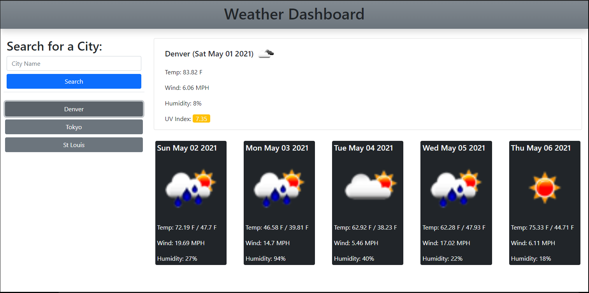

# WeatherDashboard-APIs

## Description

I built a weather dashboard using the Open Weather API along with jquery and bootstrap APIs.
I used dynamically created html blocks to append and display the information on the page.

cities that you have searched for will display in a list on screen and will be saved into local storage.

I learned a good amount about how to use third party apis as well as server side APIs.

## Link

[https://ajurgs.github.io/WeatherDashboard-APIs/](https://ajurgs.github.io/WeatherDashboard-APIs/)

## Screenshot

## credits

bootstrap

jQuery

weather data from
[OpenWeather](https://openweathermap.org/)

worked on this project with my tutor Brian Lee
